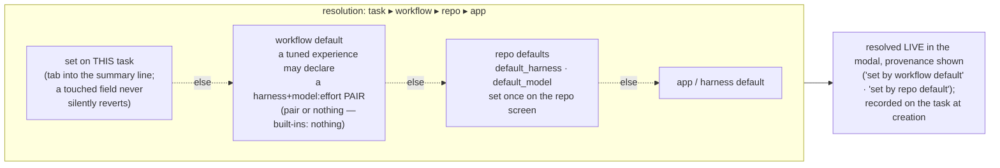

# Harness and model selection

**The governing principle: two actions to a running agent.** The repo governs everything;
overrides exist for you to see and change, but stay out of your way by default.

## How selection works today

A task records two opaque strings at creation — `harness` and `starting_model` — and the
control plane never interprets them; each harness gives them meaning.

- **Harness** (which agent CLI runs the container): explicit on the task ▸ the repo's
  `default_harness` ▸ claude. First match wins; the *resolved* name is recorded, so changing
  a repo default never re-routes existing tasks.
- **Model**: explicit `starting_model` ▸ the harness's own default. The string's vocabulary
  belongs to the harness — `opus` (claude), `gpt-5.6-sol` (codex), `provider/model` (pi), or an
  Outfitter **profile id**. An Outfitter profile owns provider, model, thinking, skills, and
  extensions, so Panopticon does not split or reinterpret that id.
- **Reasoning effort** rides the same string as a suffix — `gpt-5.6-sol:high` — translated
  per CLI (codex: `--config model_reasoning_effort`; pi natively reads `model:thinking`).
  One stored string, no schema growth per dimension.
- **Credentials** come from the repo: `env_file` (API keys, non-rotating tokens) and
  `credential_dir` (shared rotating credentials, e.g. a ChatGPT subscription auth.json).
  See [auth.md](./auth.md).

## Quickstart: detect, confirm, go

`panopticon quickstart` probes every registered harness without making the control plane choose
for you. For each adapter it checks whether the adapter's host CLI is on `PATH` and calls that
adapter's `missing_auth(environ, home)` check. It prints the evidence before prompting.

The recommendation order is: an installed, already-authenticated harness; any installed harness;
then Claude guidance when none is installed. One installed candidate needs only Enter to confirm.
Several produce a numbered picker with `authed`, `installed`, or `not installed` status and the
adapter's install hint. The choice becomes the repo's `default_harness`; quickstart deliberately
leaves `default_model` unset because task creation owns model choice.

`panopticon doctor` follows the same registry: it reports one line per harness CLI and requires at
least one, rather than requiring Claude specifically.

## Default resolution

- **Workflow defaults are a pair or nothing** — `default_harness` + `default_model:effort`
  declared together, or neither. A bare model with no harness scope can land on a CLI that
  doesn't speak it (the opus-on-codex bug class). Built-in workflows declare nothing, so a
  pair only ever exists because an operator tuned one — naming a harness they use and auth.
- **Defaults are never locks.** The new-task modal shows one summary line —
  `codex · gpt-5.6-sol · high (set by repo default)` — resolved live; tab into it to
  override. Provenance is load-bearing with four sources, not decoration.
- **Touch-protection is draft-scoped.** A field the operator touched survives workflow
  re-selection within the open draft, and exactly that long — a fresh modal always resolves
  from the chain. There is no cross-task "last selected" memory.
- **No navigation loses typed input.** Unsent drafts (memo + touched picker state) persist,
  so in-context jumps (create a profile, edit repo defaults) are safe.
- **Per-harness pickers are advisory.** Each harness supplies suggested models/efforts and
  its field label as static adapter data; free text is always valid; nothing validates
  vocabularies centrally. pi's list can come from its native `pi --list-models`. An
  outfitter harness would label the field **profile** — a profile id subsumes
  provider + model + thinking + loadout, which is where local models arrive without the
  control plane learning anything about providers.

## Ownership

| Layer | Owns | Where set |
|---|---|---|
| **Task** | override of harness / model / effort | task modal |
| **Repo** | `default_harness`, `default_model`, `env_file`, `credential_dir` | quickstart / repo screen |
| **Workflow** | lifecycle + skills; *optional* tuned harness+model pair | workflow code |
| **Harness** | vocabulary, suggestion lists, field label, CLI mechanics | adapter code |

## Outfitter adapter

Outfitter 0.11.0 is registered and selectable. That release fixed the width-unsafe startup header
that blocked 0.10.0 in detached tmux, and the adapter passed the narrow-pane live smoke. Because
quickstart detection iterates the registry, an installed Outfitter CLI appears in onboarding.
`setup-repo` intentionally has no approved Outfitter-specific auth dispatch yet; it reports that
gap instead of guessing. Configure Pi-compatible auth manually as described below, then rerun or
complete setup.

The Outfitter harness writes `~/.outfitter/settings.yml` with one local source:
`~/.outfitter/profile_sources/`. Populate that directory before launch with a catalog's flat
profile YAML files or directory profiles (`<id>/profile.yml`), then set the task's
`starting_model` to the selected profile id. Outfitter also supports catalog repositories under
its own settings format, but Panopticon does not yet fetch, mount, or otherwise provision them.
That missing population mechanism is an explicit v1 integration gap, not an implicit host mount.

Outfitter launches pi underneath, so authentication is pi authentication: provider environment
variables work as they do for pi, and a repo `credential_dir` may supply pi's `auth.json`.
Outfitter builds a temporary composite Pi config and symlinks its `auth.json` from the selected
profile's `cli_specific/pi/auth.json` when that file exists, otherwise from
`~/.pi/agent/auth.json`. Bootstrap links the credential-dir file at that native fallback; it does
not overwrite profile-owned auth.

Panopticon launches Outfitter interactively in tmux. Outfitter also supports Pi's headless flags
(`-p`/`--print`, `--export`, and `--list-models`): its source appends pass-through arguments after
profile controls and suppresses its interactive runtime extension for those modes. A live
operator smoke that appended `-p` hung with no Pi output, but that flag is not part of the
Panopticon argv. The normal launch inherits the tmux TTY, contains no headless flag, and was
verified through Outfitter's “launching pi” boundary.
