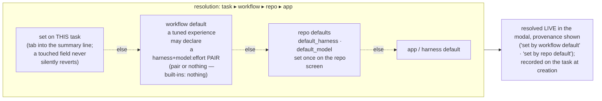

# Harness and model selection

**The governing principle: two actions to a running agent.** The repo governs everything;
overrides exist for you to see and change, but stay out of your way by default.

## How selection works today

A task records two opaque strings at creation — `harness` and `starting_model` — and the
control plane never interprets them; each harness gives them meaning.

- **Harness** (which agent CLI runs the container): explicit on the task ▸ the repo's
  `default_harness` ▸ claude. First match wins; the *resolved* name is recorded, so changing
  a repo default never re-routes existing tasks.
- **Model**: explicit `starting_model` ▸ the harness's own default. The string's vocabulary
  belongs to the harness — `opus` (claude), `gpt-5.6-sol` (codex), `provider/model` (pi), or an
  Outfitter **profile id**. An Outfitter profile owns provider, model, thinking, skills, and
  extensions, so Panopticon does not split or reinterpret that id.
- **Reasoning effort** rides the same string as a suffix — `gpt-5.6-sol:high` — translated
  per CLI (codex: `--config model_reasoning_effort`; pi natively reads `model:thinking`).
  One stored string, no schema growth per dimension.
- **Credentials** come from the repo: `env_file` (API keys, non-rotating tokens) and
  `credential_dir` (shared rotating credentials, e.g. a ChatGPT subscription auth.json).
  See [auth.md](./auth.md).

## Approved design direction (not yet built)

- **Workflow defaults are a pair or nothing** — `default_harness` + `default_model:effort`
  declared together, or neither. A bare model with no harness scope can land on a CLI that
  doesn't speak it (the opus-on-codex bug class). Built-in workflows declare nothing, so a
  pair only ever exists because an operator tuned one — naming a harness they use and auth.
- **Defaults are never locks.** The new-task modal shows one summary line —
  `codex · gpt-5.6-sol · high (set by repo default)` — resolved live; tab into it to
  override. Provenance is load-bearing with four sources, not decoration.
- **Touch-protection is draft-scoped.** A field the operator touched survives workflow
  re-selection within the open draft, and exactly that long — a fresh modal always resolves
  from the chain. There is no cross-task "last selected" memory.
- **No navigation loses typed input.** Unsent drafts (memo + touched picker state) persist,
  so in-context jumps (create a profile, edit repo defaults) are safe.
- **Per-harness pickers are advisory.** Each harness supplies suggested models/efforts and
  its field label as static adapter data; free text is always valid; nothing validates
  vocabularies centrally. pi's list can come from its native `pi --list-models`. An
  outfitter harness would label the field **profile** — a profile id subsumes
  provider + model + thinking + loadout, which is where local models arrive without the
  control plane learning anything about providers.

## Ownership

| Layer | Owns | Where set |
|---|---|---|
| **Task** | override of harness / model / effort | task modal |
| **Repo** | `default_harness`, `default_model` *(planned)*, `env_file`, `credential_dir` | repo screen |
| **Workflow** | lifecycle + skills; *optional* tuned harness+model pair *(planned)* | workflow code |
| **Harness** | vocabulary, suggestion lists, field label, CLI mechanics | adapter code |

## Experimental Outfitter adapter (blocked, unregistered)

The Outfitter adapter is not selectable. A live detached-tmux smoke reached Pi with inherited
stdio, then crashed in pi-tui rendering: Outfitter 0.10.0 always injects an interactive startup
header whose renderer ignores the pane width, and pi-tui rejects custom component lines wider
than the terminal. Disabling ASCII art is insufficient because other fixed header lines are also
unbounded. Outfitter must change that component to render against its `width` argument and
wrap/truncate every line, then pass a narrow-terminal regression and Panopticon's live tmux smoke.

The remaining notes describe the staged adapter and become active only after that upstream fix.

The Outfitter harness writes `~/.outfitter/settings.yml` with one local source:
`~/.outfitter/profile_sources/`. Populate that directory before launch with a catalog's flat
profile YAML files or directory profiles (`<id>/profile.yml`), then set the task's
`starting_model` to the selected profile id. Outfitter also supports catalog repositories under
its own settings format, but Panopticon does not yet fetch, mount, or otherwise provision them.
That missing population mechanism is an explicit v1 integration gap, not an implicit host mount.

Outfitter launches pi underneath, so authentication is pi authentication: provider environment
variables work as they do for pi, and a repo `credential_dir` may supply pi's `auth.json`.
Outfitter builds a temporary composite Pi config and symlinks its `auth.json` from the selected
profile's `cli_specific/pi/auth.json` when that file exists, otherwise from
`~/.pi/agent/auth.json`. Bootstrap links the credential-dir file at that native fallback; it does
not overwrite profile-owned auth.

Panopticon launches Outfitter interactively in tmux. Outfitter also supports Pi's headless flags
(`-p`/`--print`, `--export`, and `--list-models`): its source appends pass-through arguments after
profile controls and suppresses its interactive runtime extension for those modes. A live
operator smoke that appended `-p` hung with no Pi output, but that flag is not part of the
Panopticon argv. The normal launch inherits the tmux TTY, contains no headless flag, and was
verified through Outfitter's “launching pi” boundary.
