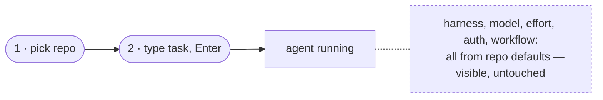
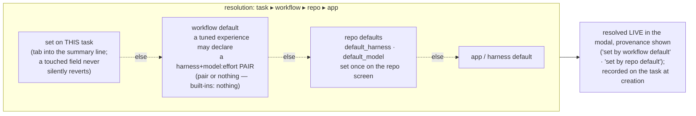

# Harness and model selection

**The governing principle: two actions to a running agent.** The repo governs everything;
overrides exist for you to see and change, but stay out of your way by default.

## How selection works today

A task records two opaque strings at creation — `harness` and `starting_model` — and the
control plane never interprets them; each harness gives them meaning.

- **Harness** (which agent CLI runs the container): explicit on the task ▸ the repo's
  `default_harness` ▸ claude. First match wins; the *resolved* name is recorded, so changing
  a repo default never re-routes existing tasks.
- **Model**: explicit `starting_model` ▸ the harness's own default. The string's vocabulary
  belongs to the harness — `opus` (claude), `gpt-5.6-sol` (codex), `provider/model` (pi).
- **Reasoning effort** rides the same string as a suffix — `gpt-5.6-sol:high` — translated
  per CLI (codex: `--config model_reasoning_effort`; pi natively reads `model:thinking`).
  One stored string, no schema growth per dimension.
- **Credentials** come from the repo: `env_file` (API keys, non-rotating tokens) and
  `credential_dir` (shared rotating credentials, e.g. a ChatGPT subscription auth.json).
  See [auth.md](./auth.md).

## Approved design direction (not yet built)

- **Workflow defaults are a pair or nothing** — `default_harness` + `default_model:effort`
  declared together, or neither. A bare model with no harness scope can land on a CLI that
  doesn't speak it (the opus-on-codex bug class). Built-in workflows declare nothing, so a
  pair only ever exists because an operator tuned one — naming a harness they use and auth.
- **Defaults are never locks.** The new-task modal shows one summary line —
  `codex · gpt-5.6-sol · high (set by repo default)` — resolved live; tab into it to
  override. Provenance is load-bearing with four sources, not decoration.
- **Touch-protection is draft-scoped.** A field the operator touched survives workflow
  re-selection within the open draft, and exactly that long — a fresh modal always resolves
  from the chain. There is no cross-task "last selected" memory.
- **No navigation loses typed input.** Unsent drafts (memo + touched picker state) persist,
  so in-context jumps (create a profile, edit repo defaults) are safe.
- **Per-harness pickers are advisory.** Each harness supplies suggested models/efforts and
  its field label as static adapter data; free text is always valid; nothing validates
  vocabularies centrally. pi's list can come from its native `pi --list-models`. An
  outfitter harness would label the field **profile** — a profile id subsumes
  provider + model + thinking + loadout, which is where local models arrive without the
  control plane learning anything about providers.

## Ownership

| Layer | Owns | Where set |
|---|---|---|
| **Task** | override of harness / model / effort | task modal |
| **Repo** | `default_harness`, `default_model` *(planned)*, `env_file`, `credential_dir` | repo screen |
| **Workflow** | lifecycle + skills; *optional* tuned harness+model pair *(planned)* | workflow code |
| **Harness** | vocabulary, suggestion lists, field label, CLI mechanics | adapter code |
